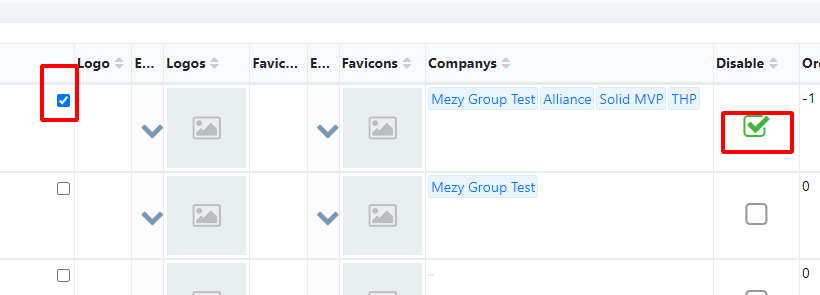

# BarTopRight: checkbox

### Example
| Key             | Type       | Description |
| ------          | ---------- | ----------- |
| configCheckbox  | Object     |             |

#### configFileIcon
| Key             | Type       | Description |
| ------          | ---------- | ----------- |
| show            | boolean    |             |
| fieldName       | String     | fieldName của row |


#### Config more
```json
{
	"configCheckbox":{
		"show":true,
		"fieldName": "IsDisable"
	}
}
```

#### Preview

