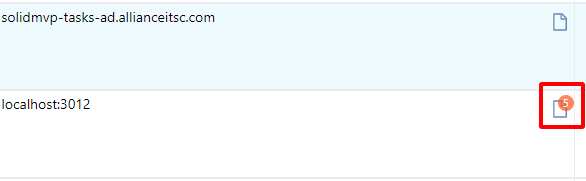

# BarTopRight: fileUpload

### Example
| Key             | Type       | Description |
| ------          | ---------- | ----------- |
| configFileIcon  | Object     |             |

#### configFileIcon
| Key             | Type       | Description |
| ------          | ---------- | ----------- |
| show            | boolean    |             |
| fieldName       | String     | fieldName của row |
| showBadge       | boolean    | Hiển thị đếm file |

#### Config more
```json
{
  "showPreviewHTML": true
}
```

#### Preview


Popup preview  

