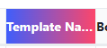

# MyTableHeader: html

### Example

#### Config

```json
{"type":"header_styled_html","html_header":"<div style='background:linear-gradient(90deg, rgba(63,94,251,1) 0%, rgba(252,70,107,1) 100%);color:#fff;'><div style=';color:#fff;'>Template Name1234</div></div>"}
```

#### Photo


