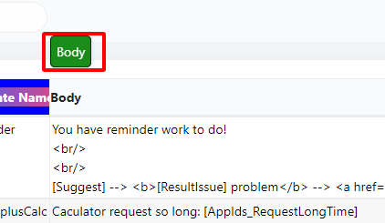

# MyTableHeader: tooltip

### Example
type:  
style:  
header:  
tooltip:  
tooltip_html:  
#### Config

```json
{"type":"tooltip","style":{"background":"inherit"},"header":"Body","tooltip":"123456","tooltip_html":"<div style='padding:6px;font-size:14px; background:green;border:1px solid #000;border-radius:5px' >Body</div>"}
```

#### Photo


