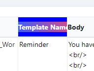

# MyTableHeader: tooltip

### Example
#type:
#style:
#html:
#### Config

```json
{"type":"html","style":{"background":"blue"},"html":"<div style='background:linear-gradient(90deg, rgba(63,94,251,1) 0%, rgba(252,70,107,1) 100%);color:#fff;'><div style=';color:#fff;'>Template Name1234</div></div>"}
```

#### Photo


