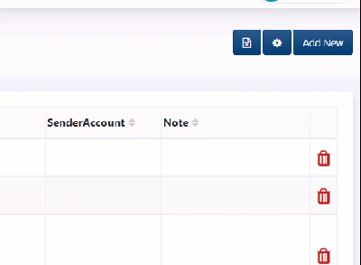

# Custom delete popover

## Config Screen Config

```javascript
{
    "Table":{
        "deleteTitle":"Delete item?",
        "deleteContent":"Delete item [Id]?",
        "deleteContentHtml":"Delete item [Id]?",
        "deleteWithNote":true,
    }
}
```

## Configs

* deleteTitle: change the title of popover
* deleteContent:
* deleteContentHtml: change content with HTML support
* deleteWithNote: Add note input&#x20;

## Examples

&#x20;


