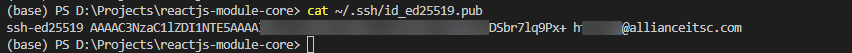

# Tạo local key ed25519

#### Chạy lệnh từ terminal (Nhớ thay đổi your-email thành email của bạn)

```
ssh-keygen -t ed25519 -C "your-email@allianceitsc.com"
```

Enter 3 lần để xác nhận nơi lưu trữ và không cần đặt passphase

Kết quả:

<figure><figcaption><p>Kết quả</p></figcaption></figure>

#### Copy dòng được vàng rồi gửi cho người yêu cầu

#### Xem lại dòng mã sau khi đã có sau này

```
cat ~/.ssh/id_ed25519.pub
```

Kết quả:

<figure><figcaption><p>Kết quả hiển thị</p></figcaption></figure>
